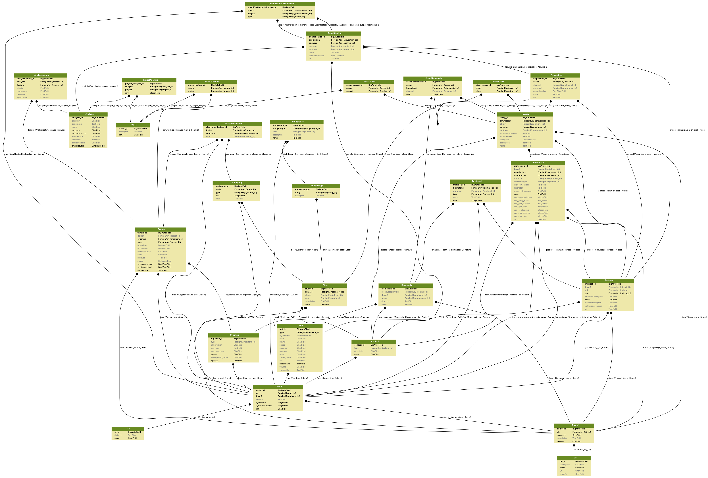
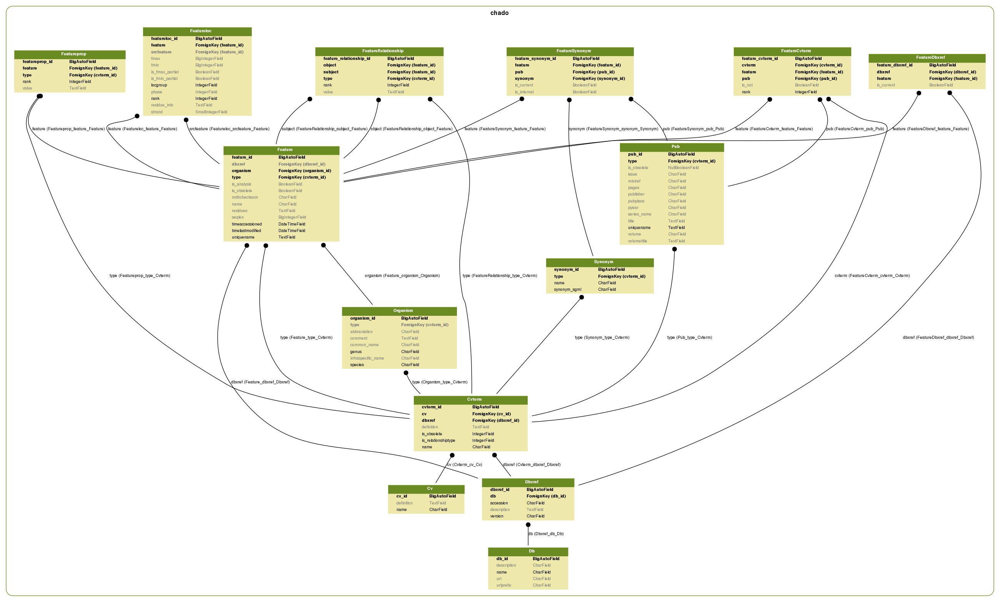
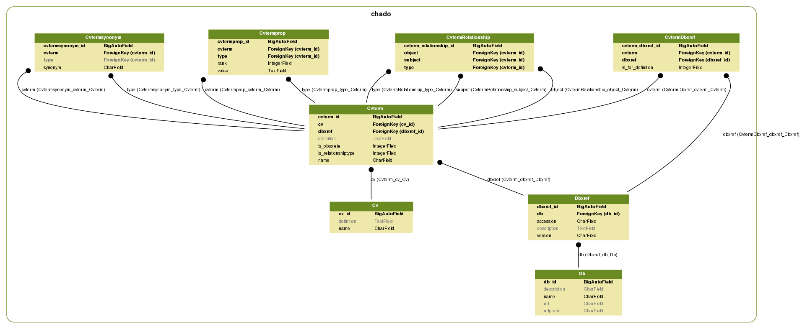
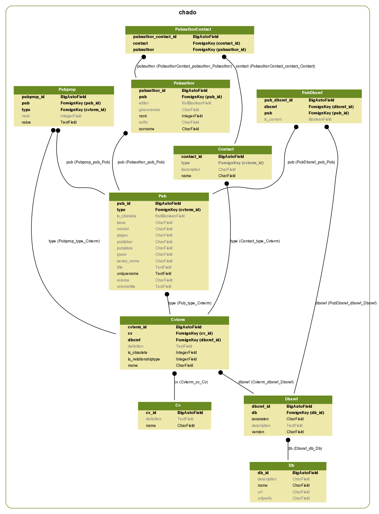
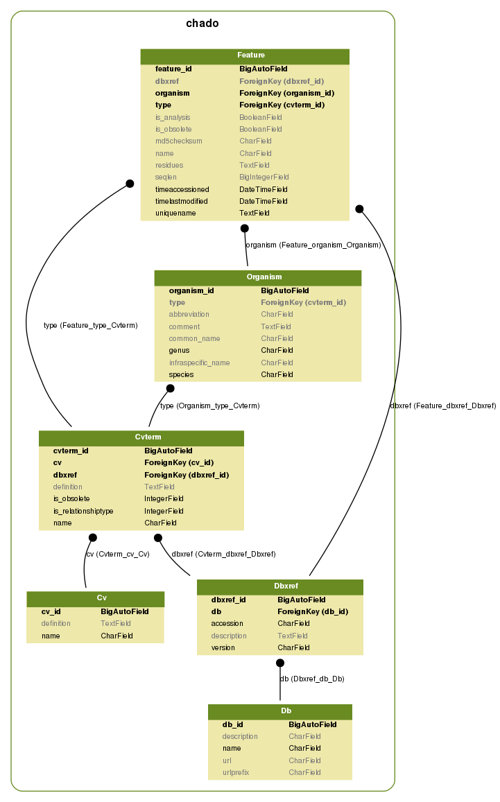
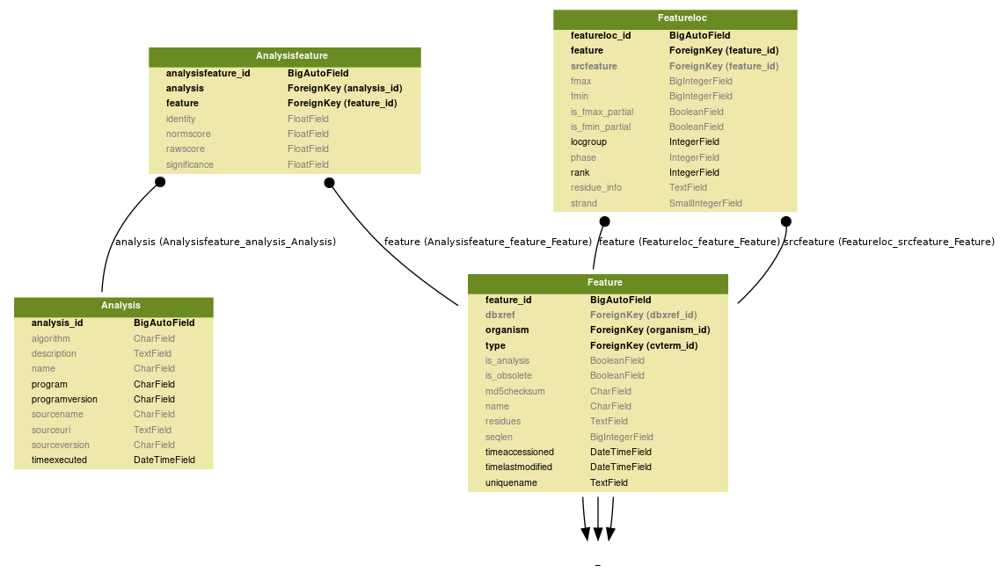
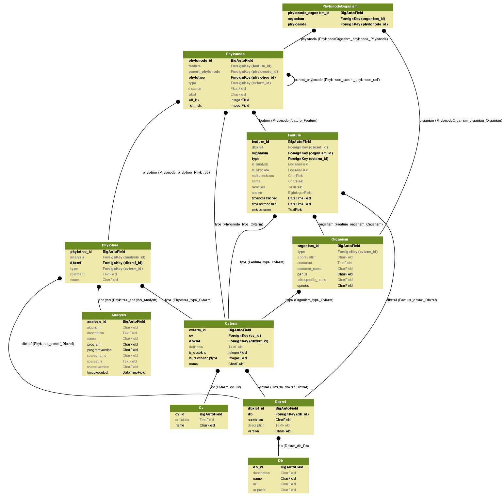

# Diagrams

## AnalysisFeature

## Feature

## Ontology

## Publication

## Sequence

## Similarity

## Taxonomy

---

> **Note:** Instructions to generate the diagrams: <https://django-extensions.readthedocs.io/en/latest/graph_models.html>
>
> Example: `python manage.py graph_models --pygraphviz -a -I Analysis,Analysisfeature,Feature -o analysis_feature.png`
